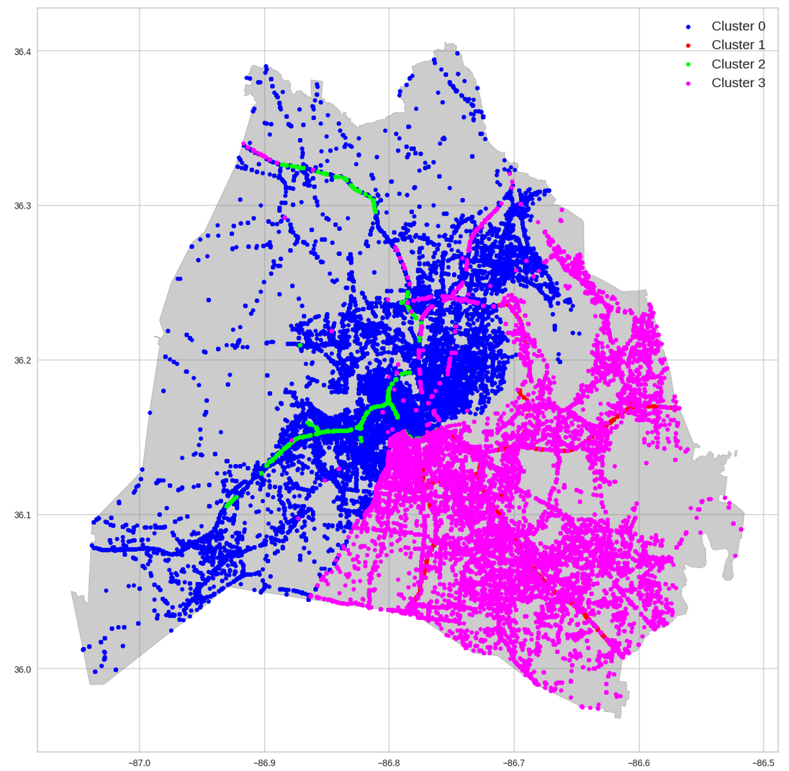

# Traffic Clustering
Nashville Traffic Accident Clustering &amp; Analysis



# Goal
Using available traffic accident data, can we answer this question:
>Where are the common hotspots in traffic accidents within the Nashville metropolitan area?

# Background
This Jupyter notebook was implemented as part of the graduate-level coursework for [CSC 722](https://catalog.dsu.edu/preview_course_nopop.php?catoid=41&coid=25783) at [Dakota State University](https://dsu.edu/).

The traffic accidents dataset was sourced from the [Nashville Open Data Portal](https://data.nashville.gov/Police/Traffic-Accidents/6v6w-hpcw/about_data)

# Prerequisites
This Jypyter notebook is written in Python 3, and has been tested to run on Linux (Debian 12) with Python 3.11.  It should work on any currently-supported Python 3.x interpreter.  

Additional libraries are contained in the `requirements.txt` file, and can be installed using the `pip` utility:

``` bash
pip install --upgrade -r ./requirements.txt
```

# Running the notebook
On Linux, you can run this program via the following command on a terminal session:

``` bash
jupyter-lab Nashville-Traffic-Accident-Clustering.ipynb
```

# References
* "Traffic Accidents | Nashville Open Data Portal." Accessed: March 31, 2024. [Online]. Available: https://data.nashville.gov/Police/Traffic-Accidents/6v6w-hpcw/about_data
* "Traffic Accidents Metadata | Nashville Open Data Portal." Accessed: March 31, 2024. [Online]. Available: https://data.nashville.gov/api/views/6v6w-hpcw/files/3af9281b-fa4f-4044-83f8-1b9a46cc6e95?download=true&filename=Traffic-Accidents-Metadata-v2.pdf
* "Davidson County Border (GIS) | Nashville Open Data Portal," Metropolitan Government of Nashville and Davidson County, Tennessee. Accessed: Dec. 01, 2023. [Online]. Available: https://data.nashville.gov/General-Government/Davidson-County-Border-GIS-/whcy-hmdk
* R. Stewart, "GeoPandas 101: Plot any data with a latitude and longitude on a map," Medium. Accessed: Nov. 30, 2023. [Online]. Available: https://towardsdatascience.com/geopandas-101-plot-any-data-with-a-latitude-and-longitude-on-a-map-98e01944b972